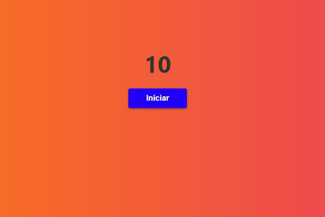
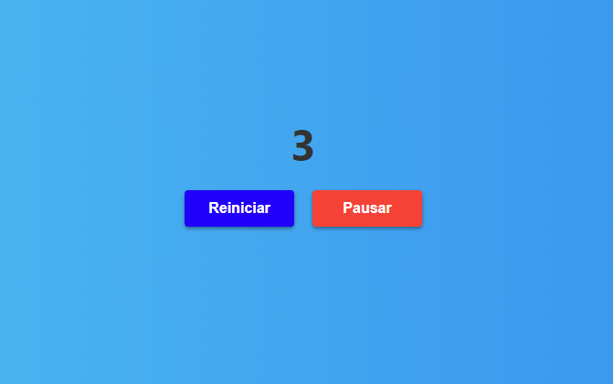

# ¡El tiempo se agota! 🕒

¡Bienvenido/a al proyecto de Conteo Regresivo! Este proyecto te permite crear un contador regresivo utilizando React y JavaScript. ¡Prepárate para divertirte mientras haces el conteo hacia atrás y añades un toque de alegría a tus proyectos!




## Características 🌟
Inicia el conteo regresivo desde un número específico y observa cómo disminuye hasta llegar a cero.
Pausa el conteo en cualquier momento para detener la cuenta regresiva y retómala cuando estés listo/a.
Reinicia el conteo en cualquier momento para comenzar desde el número inicial nuevamente.
Interfaz de usuario intuitiva y fácil de usar.
Animaciones suaves y efectos visuales atractivos para mantener el interés.

## Cómo utilizar el proyecto 🚀
Sigue los pasos a continuación para utilizar el proyecto de Conteo Regresivo en tu aplicación:

Asegúrate de tener instalada la biblioteca de React en tu proyecto.
Descarga los archivos del proyecto o clona este repositorio en tu máquina local.
Navega hasta la carpeta del proyecto en tu terminal.
Instala las dependencias necesarias ejecutando el siguiente comando:
```
npm install
```
Abre el archivo ConteoRegresivo.js y personaliza las configuraciones según tus necesidades (como el número de inicio del conteo).
Ejecuta la aplicación en tu entorno de desarrollo local con el siguiente comando:
```
npm start
```
Abre tu navegador y ve a http://localhost:3000 para ver el contador regresivo en acción.
Ejemplo de Uso 💡


***¡Diviértete y disfruta del emocionante viaje del Conteo Regresivo!😄🚀🎉***